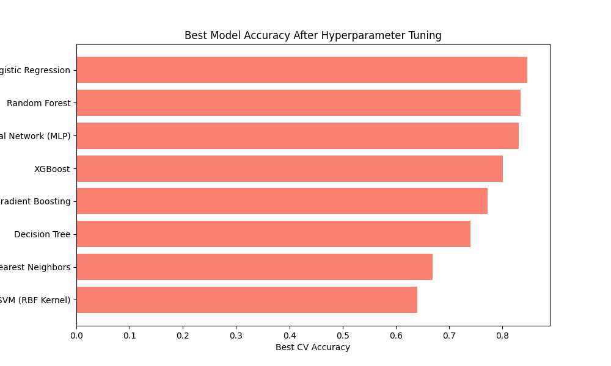
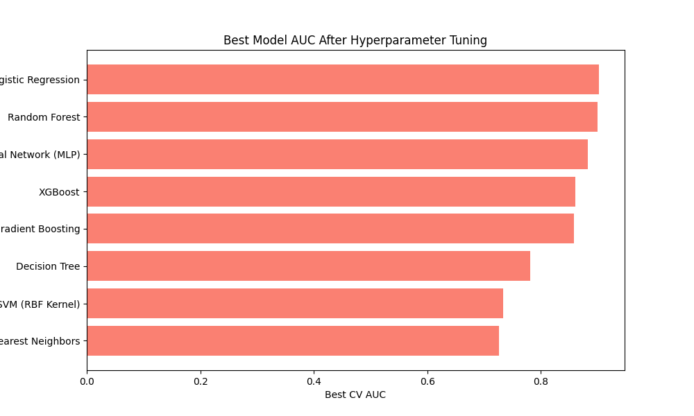
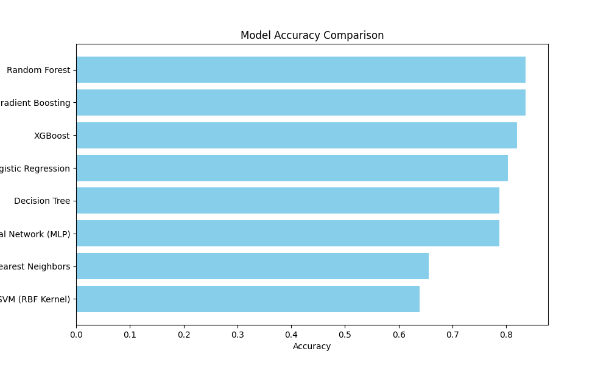
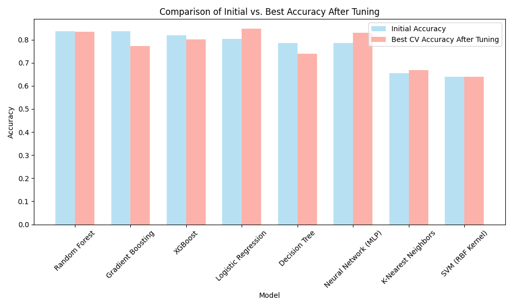
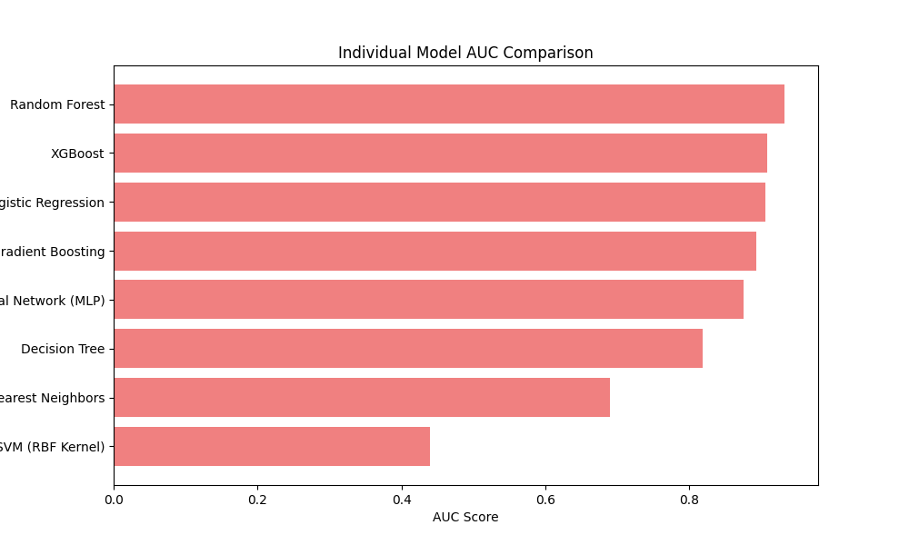
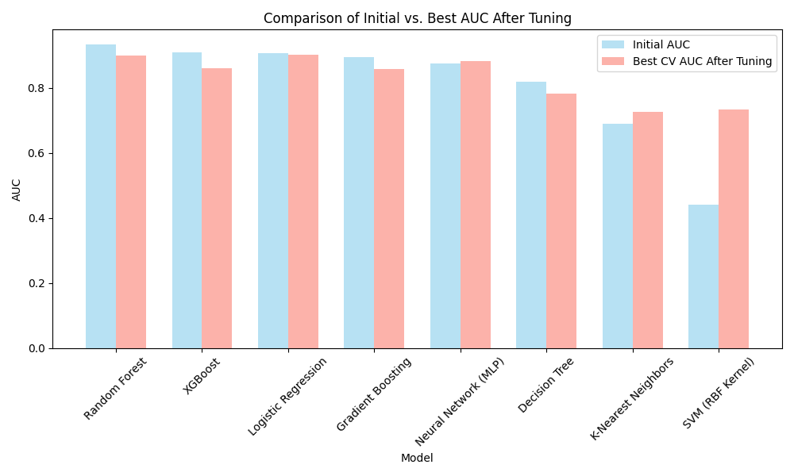

# Heart Disease Prediction

This repository hosts a comprehensive machine learning project designed to predict heart disease in patients using various clinical and demographic features. The project employs multiple machine learning algorithms, ensemble techniques, and hyperparameter tuning methods to enhance the predictive accuracy of the models. The goal is to create a robust and reliable model that can assist healthcare providers in early diagnosis of heart disease.

## Table of Contents
- [Project Overview](#project-overview)
- [Dataset](#dataset)
- [Features](#features)
- [Data Preprocessing](#data-preprocessing)
- [Modeling Approach](#modeling-approach)
- [Ensemble Learning](#ensemble-learning)
- [Performance Metrics](#performance-metrics)
- [Results](#results)
- [Installation](#installation)
- [Contributors](#contributors)

## Project Overview
The primary objective of this project is to develop machine learning models that can accurately predict the presence of heart disease based on clinical data. By leveraging a variety of machine learning algorithms and ensemble techniques, the project aims to provide a tool for early heart disease detection, thus facilitating preventative healthcare. The project comprises several stages: data preprocessing, feature engineering, model training and evaluation, hyperparameter tuning, and visualization of results.

## Dataset
The dataset used in this project is derived from clinical records and contains essential features that serve as indicators of heart disease. This dataset includes both demographic and clinical information, making it suitable for evaluating machine learning models’ predictive capabilities.

### Key Columns
- **Age**: Age of the patient in years.
- **Sex**: Gender of the patient (1 = male, 0 = female).
- **CP (Chest Pain Type)**: Type of chest pain, categorized as:
  - 0: Typical angina
  - 1: Atypical angina
  - 2: Non-anginal pain
  - 3: Asymptomatic
- **Trestbps (Resting Blood Pressure)**: Resting blood pressure in mm Hg.
- **Chol (Serum Cholesterol)**: Serum cholesterol in mg/dl.
- **FBS (Fasting Blood Sugar)**: Fasting blood sugar level > 120 mg/dl (1 = true, 0 = false).
- **Restecg (Resting Electrocardiographic Results)**:
  - 0: Normal
  - 1: Having ST-T wave abnormality
  - 2: Showing probable or definite left ventricular hypertrophy
- **Thalach (Max Heart Rate Achieved)**: Maximum heart rate achieved during an exercise test.
- **Exang (Exercise-Induced Angina)**: Indicates whether exercise-induced chest pain occurs (1 = yes, 0 = no).
- **Oldpeak**: ST depression induced by exercise relative to rest.
- **Slope**: Slope of the peak exercise ST segment (0, 1, or 2).
- **Ca (Number of Major Vessels)**: Number of major vessels (0–3) colored by fluoroscopy.
- **Thal**: A categorical indicator of thalassemia (3 = normal, 6 = fixed defect, 7 = reversible defect).
- **Target (Presence of Heart Disease)**: The target variable indicating the presence (1) or absence (0) of heart disease.

## Features
This project focuses on extracting relevant features from the dataset to build predictive models. The target variable is a binary indicator of heart disease (1 = disease, 0 = no disease).

## Data Preprocessing
Preprocessing is a critical step in machine learning workflows. For this project, data preprocessing involves:
1. **Handling Missing Values**: Missing data is imputed using mean values to ensure consistency.
2. **Standardization**: All numerical features are standardized, which helps models that rely on feature scaling (such as SVM and Neural Networks) to perform optimally.
3. **One-Hot Encoding**: Categorical variables are converted to binary columns using one-hot encoding to prepare them for models that do not natively handle categorical data.

## Modeling Approach
This project evaluates multiple machine learning algorithms to identify the best performing model. The following models are implemented, tuned, and compared:

### Baseline Models
1. **Logistic Regression**: A simple yet effective statistical model used as a baseline for binary classification tasks.
2. **K-Nearest Neighbors (KNN)**: A distance-based model that classifies samples based on the majority class of the k-nearest neighbors.
3. **Support Vector Machine (SVM)**: A model that constructs a hyperplane in high-dimensional space for class separation, useful for binary classification.
4. **Decision Tree**: A non-parametric model that partitions data using a series of decision rules derived from the features.
5. **Random Forest**: An ensemble of decision trees that averages predictions for improved accuracy and generalization.
6. **Gradient Boosting**: A boosting algorithm that builds models sequentially to minimize errors of previous models.
7. **XGBoost**: An optimized version of gradient boosting, known for its speed and efficiency.
8. **Neural Network (Multi-Layer Perceptron)**: A basic deep learning model with hidden layers, suitable for learning complex patterns in data.

### Hyperparameter Tuning
Each model undergoes extensive hyperparameter tuning using Grid Search and Randomized Search to find the optimal configuration. The hyperparameters tuned include:
- **Logistic Regression**: Regularization strength (C).
- **K-Nearest Neighbors**: Number of neighbors (k) and distance metric.
- **SVM**: Kernel type, regularization parameter (C), and kernel coefficient (gamma).
- **Decision Tree**: Maximum depth, minimum samples split.
- **Random Forest**: Number of trees (n_estimators), maximum depth.
- **Gradient Boosting**: Learning rate, number of boosting stages.
- **XGBoost**: Learning rate, maximum depth, and subsample ratio.
- **Neural Network**: Number of layers, number of units per layer, dropout rate.

## Ensemble Learning
To improve model accuracy and robustness, ensemble techniques are employed. Ensemble learning combines the predictions from multiple models to create a stronger meta-model. This project implements two ensemble methods:

### Stacking
In stacking, the predictions from individual base models are used as input features for a meta-model (Logistic Regression) to make the final prediction. This approach leverages the strengths of multiple models and often yields better results than any single model alone.

### Voting
In the voting approach, predictions from each model are combined, and the final output is based on the majority vote (for classification). This method is effective in reducing variance and improving model stability.

## Performance Metrics
The primary performance metric for evaluating the models is **accuracy**, which is the proportion of correctly predicted instances out of the total instances. This metric is particularly suitable for binary classification tasks.

## Results
The following visualizations summarize the performance of individual models, ensemble techniques, and comparison between initial and tuned models.

### Individual Model Performance (Accuracy and AUC)
1. **Best Model Accuracy After Hyperparameter Tuning**:
   
   
2. **Best Model AUC After Hyperparameter Tuning**:
   
   
3. **Model Accuracy Comparison**:
   
   
4. **Comparison of Initial vs. Best Accuracy After Tuning**:
   
   
5. **Individual Model AUC Comparison**:
   
   
6. **Comparison of Initial vs. Best AUC After Tuning**:
   

## Installation
1. Clone the repository:
   ```bash
   git clone https://github.com/AzimNahin/Heart-Disease-Prediction.git
2. Navigate to the project directory:
   ```bash
   cd Heart-Disease-Prediction
3. Install the required Python packages:
   ```bash
   pip install -r requirements.txt

## Contributors  
- [AzimNahin](https://github.com/AzimNahin)
